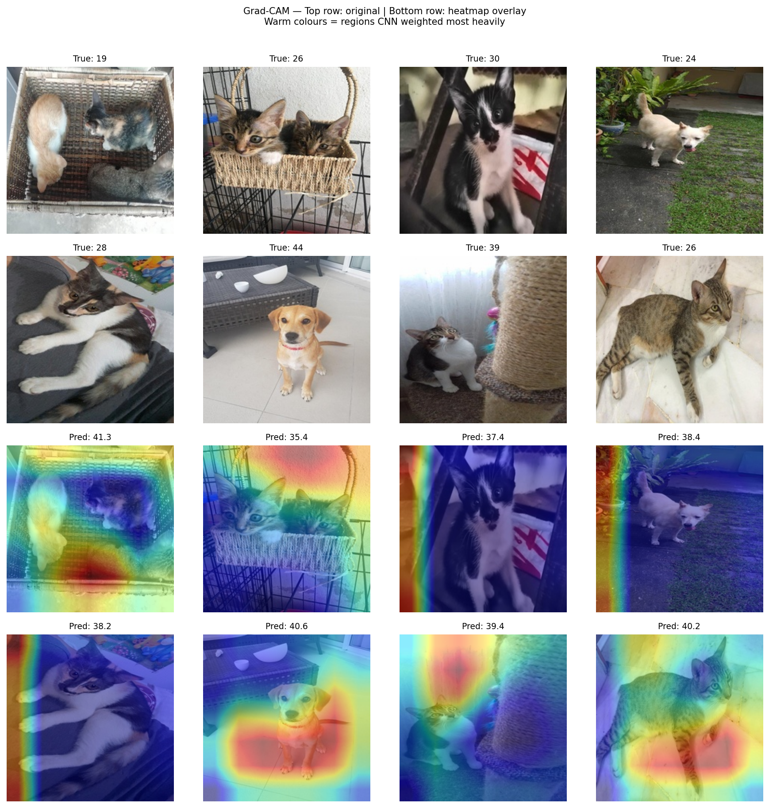

# cs273p-Final-Project — Pawpularity Score Prediction

Predicting the popularity ("Pawpularity") of pet photos from the [PetFinder.my Kaggle dataset](https://www.kaggle.com/datasets/schulta/petfinder-pawpularity-score-clean) using a multimodal deep learning model that fuses image features (EfficientNet-B0) with structured tabular metadata.

---

## Project Overview

This project builds and evaluates a multimodal regression model for the Pawpularity prediction task:

- **Input:** a pet photo + 12 binary metadata features (e.g., eyes visible, accessory present, blurry)
- **Output:** a continuous Pawpularity score in [1, 100]
- **Metric:** Root Mean Squared Error (RMSE)

### Architecture

```
Image (224×224) ──► EfficientNet-B0 ──► (1280-d feature)
                                                         ──► Concat ──► FC Head ──► score
Metadata (12 binary) ──► Tabular MLP ──► (32-d feature)
```

Four `fusion_mode` variants are supported:

| Mode | Description |
|---|---|
| `fusion_concat` | Image + Tabular concatenated → FC head (baseline) |
| `fusion_attention` | Image + Tabular fused via learned gated attention |
| `image_only` | Image encoder → FC head (ablation) |
| `tabular_only` | Tabular MLP → FC head (ablation) |

---

## Repository Structure

```
cs273p-Final-Project/
├── configs/             # YAML training configs
│   ├── default.yaml
│   ├── ablation_image_only.yaml
│   ├── ablation_tabular_only.yaml
│   └── ablation_attention_fusion.yaml
├── data/
│   ├── raw/             # Downloaded dataset (train.csv, train/, test/)
│   ├── resized/         # 224×224 resized images
│   └── debug/           # 100-image subset for quick testing
├── notebooks/
│   └── demo.ipynb       # Demo notebook — run inference, Grad-CAM, reproduce results
├── scripts/
│   ├── download_data.py # Downloads dataset via Kaggle API
│   ├── resize_images.py # Resizes images to 224×224
│   └── grad_cam.py      # Grad-CAM visualisation
├── src/
│   ├── dataset.py       # PawpularityDataset and DataLoader factory
│   ├── model.py         # PawpularityModel (all fusion modes)
│   ├── train.py         # Training loop
│   └── utils.py         # Helpers (RMSE, seed, device)
├── checkpoints/         # Saved model checkpoints (.pt files)
├── assets/              # Static assets (e.g., gradcam_grid.png)
├── environment.yml      # Conda environment spec
└── README.md
```

---

## Dependencies

Key libraries (full spec in `environment.yml`):

| Package | Version |
|---|---|
| Python | 3.11 |
| PyTorch + Torchvision | latest (via `pytorch` channel) |
| pandas | latest |
| scikit-learn | latest |
| Pillow | latest |
| tqdm | latest |
| matplotlib | latest |
| tensorboard | latest |
| kaggle (pip) | latest |

---

## Setup Instructions

### 1. Clone the repository

```bash
git clone <REPO_URL>
cd cs273p-Final-Project
```

### 2. Create and activate the conda environment

```bash
conda env create -f environment.yml
conda activate pawpularity
```

### 3. Set up Kaggle API credentials

You need a Kaggle account to download the dataset.

1. Go to [https://www.kaggle.com/settings](https://www.kaggle.com/settings) → **API** → **Create New Token**
2. This downloads a `kaggle.json` file. Move it to `~/.kaggle/`:
   ```bash
   mkdir -p ~/.kaggle
   mv ~/Downloads/kaggle.json ~/.kaggle/kaggle.json
   chmod 600 ~/.kaggle/kaggle.json
   ```

---

## Dataset

### Where to download

This project uses the pre-cleaned community version of the PetFinder dataset:

> **https://www.kaggle.com/datasets/schulta/petfinder-pawpularity-score-clean**

> **Note:** The official Kaggle competition data was unavailable, so this cleaned community re-upload was used instead. It contains the same images and metadata with no additional transformations applied.

### Download and preprocess

```bash
# Step 1: Download from Kaggle → data/raw/
python scripts/download_data.py

# Step 2: Resize all images to 224×224 → data/resized/
#         Also creates a 100-image debug subset → data/debug/
python scripts/resize_images.py
```

**What these scripts produce:**

| Path | Contents |
|---|---|
| `data/raw/train.csv` | Labels + metadata for ~9,900 training images |
| `data/raw/train/` | Original training images |
| `data/resized/train/` | 224×224 JPEG images ready for the DataLoader |
| `data/debug/train/` | 100-image subset for rapid sanity checks |
| `data/debug/train.csv` | Matching CSV for the debug subset |

### Sample dataset

A 100-image debug subset is automatically created by `resize_images.py` and saved to `data/debug/`. This can be used to run the full pipeline without the complete dataset.

---

## Training

### Quick debug run (100 images, ~1 min)

```bash
python -m src.train
```

### Full training (baseline, 25 epochs)

```bash
python -m src.train --config configs/default.yaml --debug_mode false --epochs 25
```

### Ablation experiments

```bash
# Image-only ablation
python -m src.train --config configs/ablation_image_only.yaml --debug_mode false

# Tabular-only ablation
python -m src.train --config configs/ablation_tabular_only.yaml --debug_mode false

# Gated attention fusion ablation
python -m src.train --config configs/ablation_attention_fusion.yaml --debug_mode false
```

### Key training arguments

| Argument | Default | Description |
|---|---|---|
| `--config` | `configs/default.yaml` | Path to YAML config |
| `--debug_mode` | `true` | `true` = 100-img debug subset; `false` = full data |
| `--epochs` | 25 | Number of training epochs |
| `--batch_size` | 32 | Batch size |
| `--lr` | 1e-3 | Learning rate |
| `--fusion_mode` | `fusion_concat` | Model variant (see table above) |
| `--freeze_backbone` | `false` | Freeze EfficientNet weights |

**Expected outputs:**
- Checkpoint saved to `checkpoints/<fusion_mode>.pt` (e.g., `checkpoints/fusion_concat.pt`)
- TensorBoard logs written to `runs/`

---

## Evaluation

Evaluation runs automatically at the end of each training epoch and the best checkpoint is saved. To reproduce validation RMSE on the saved checkpoint, re-run training with the same config (the val split is deterministic via `seed=42`):

```bash
python -m src.train --config configs/default.yaml --debug_mode false --epochs 25
```

The final output will print:
```
Best val RMSE: 20.53 at epoch 20
Checkpoint   : checkpoints/fusion_concat.pt
```

To launch TensorBoard and inspect training curves:
```bash
tensorboard --logdir runs/
```

---

## Grad-CAM Interpretability

Generate Grad-CAM heatmaps showing which image regions the CNN focused on:

```bash
python scripts/grad_cam.py --checkpoint checkpoints/fusion_concat.pt --n_images 16
```

Output saved to `runs/gradcam/gradcam_grid.png`.



**How to read:** Top row = original images with true scores. Bottom row = heatmap overlay with predicted scores. Warm colours (red/yellow) = regions the CNN weighted most heavily.

---

## Results

### Hardware
- Apple M4 MacBook Air · PyTorch MPS backend · ~9,900 training images

### Baseline

Full dataset, 25 epochs, batch size 32, EfficientNet-B0 + Tabular MLP, concat fusion.

| Epochs | Batch Size | Best Val RMSE | Best Epoch |
|--------|------------|---------------|------------|
| 25 | 32 | **20.53** | 20 |

### Ablation 1: What contributes to performance?

| Model | What it uses | Val RMSE | vs Baseline |
|-------|-------------|----------|-------------|
| **Fusion Concat** *(baseline)* | Image + Tabular | **20.53** | — |
| Image Only | Image only | 20.59 | +0.06 |
| Tabular Only | Metadata only | 20.58 | +0.05 |

**Finding:** Both modalities contribute independently. Combining them gives the best result. Tabular features alone (RMSE 20.58) slightly edge out image-only (RMSE 20.59), showing the 12 binary metadata features carry real signal beyond what the image alone provides.

### Ablation 2: Does a smarter fusion strategy help?

| Fusion Strategy | Description | Val RMSE | vs Baseline |
|----------------|-------------|----------|-------------|
| **Concat** *(baseline)* | Simple concatenation of features | **20.53** | — |
| Gated Attention | Learned gate weights each modality | 20.60 | +0.07 |

**Finding:** Simple concatenation outperforms gated attention on this dataset. The attention mechanism adds ~1.7M parameters but no accuracy benefit — the dataset is too noisy and small for the extra complexity to pay off.

### Key Takeaway

All models converge near RMSE ~20.5, close to the dataset's inherent noise floor (Pawpularity std ≈ 20.6). This is consistent with top public Kaggle solutions (~17–18 RMSE) which required large ensembles and test-time augmentation. The multimodal fusion design is validated as the best single-model configuration tested.

---

## Reproducing Results

To reproduce the exact results reported above:

```bash
# 1. Set up environment
conda env create -f environment.yml && conda activate pawpularity

# 2. Download and preprocess data
python scripts/download_data.py
python scripts/resize_images.py

# 3. Train baseline
python -m src.train --config configs/default.yaml --debug_mode false --epochs 25

# 4. Train ablations
python -m src.train --config configs/ablation_image_only.yaml --debug_mode false
python -m src.train --config configs/ablation_tabular_only.yaml --debug_mode false
python -m src.train --config configs/ablation_attention_fusion.yaml --debug_mode false

# 5. Generate Grad-CAM
python scripts/grad_cam.py --checkpoint checkpoints/fusion_concat.pt --n_images 16
```

All random seeds are fixed at `seed=42`. Results may vary slightly on different hardware due to floating-point non-determinism with MPS/CUDA backends.

---